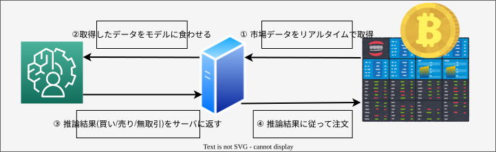

# 個人開発をしてその結果を発表したかった

- [個人開発をしてその結果を発表したかった](#個人開発をしてその結果を発表したかった)
  - [TL;DR](#tldr)
  - [背景](#背景)
  - [システムトレードとは](#システムトレードとは)
    - [特徴](#特徴)
    - [予測手法](#予測手法)
      - [回帰](#回帰)
      - [分類](#分類)
      - [一般的なモデル開発と異なる点](#一般的なモデル開発と異なる点)
  - [使用データとトレード対象](#使用データとトレード対象)
  - [やりたいこと](#やりたいこと)
  - [スケジュール(予定)](#スケジュール予定)
  - [おまけ](#おまけ)
    - [ライフハック(卑)](#ライフハック卑)
      - [日経新聞を無料で読もう](#日経新聞を無料で読もう)
      - [GPUを無料で使おう](#gpuを無料で使おう)

## TL;DR

- ふと興味が湧いたのでシステムトレード開発を行うことにした
- そのために、「価格予測モデル」と「売買システム」の開発を行う
  - 「モデル開発」と「システム開発」の勉強を一気にできてお得
- 今回は以下の内容について発表する
  - システムトレードについて
  - スケジュール
  - おまけ
- 次回までには開発進めておくので許してください

## 背景

- PALMの仕事してるけど、最近コードを書いてない
  - 銀行へパッケージシステムの導入作業をしているが、ExcelとDBとの睨めっこ&GUIでポチポチ処理を実行するのがメイン。
- どっちかっていうと設計したりコード書いたりして何かしらの「開発」をしたいなあ
  - なら自分で好きなものを好きなように開発すればよくね？？？
- 個人開発のテーマ
  - システムトレード
  - 上手くいったら億万長者になれるので

## システムトレードとは

特段普遍的な定義は存在しないが、ここでは以下のように定義する

```
何らかの形式的なアルゴリズムを用いた金融商品の自動売買システム
```

以下では、アルゴリズムトレードの特徴、予測手法、について解説する

### 特徴

- 統計的手法で価格変動の予測が可能
  - 予測手法は後述
  - 人間の曖昧な勘や経験に頼るよりも、データに基づくアルゴリズムの方が一貫したパフォーマンスを発揮できる可能性が高い。
- 人力では不可能な売買注文が可能
  - 365日24H絶えず市場を監視し、条件を満たし次第売買注文を出してくれる
- 人間の感情を除いたトレードが可能
  - 人間の感情に起因するミスを防ぐ。以下は典型例：
    - ① 利確・損切りができない
      - 事前に設定した利確（または損切り）ラインを超えても、欲や希望により適切なタイミングでポジションを閉じられない。
    - ② トレード戦略のブレ
      - ポジションを持った後、戦略を頻繁に変更し、利確・損切りラインが曖昧になる。
  - システムトレードでは、事前に設定された戦略やパラメータを忠実に実行するため、このような問題が回避される

### 予測手法

#### 回帰

- 目的
  - 過去の価格データから、将来の価格やリターンを数値として予測する。

- 使用例
  - 例えば、次の日の終値や、数時間後のリターンを予測する場合に利用。
  - 回帰分析を用いることで、価格の変動パターンを定量的にモデル化できる。

- 具体例
  - 線形回帰: 単純なモデルだが、短期予測や特定の市場条件下で有効な場合がある。
  - LSTM（長短期記憶）: 時系列データを扱う深層学習モデルで、複雑な価格パターンをキャプチャできる。

#### 分類

- 目的
  - 将来の価格の変動方向をクラス分類として予測する。
  - 例えば、「次のタイムフレームで価格が上がるか下がるか」を予測する。

- 使用例
  - 「UP」「DOWN」の二値分類問題として扱う。
  - 実際の取引では、「UP」「DOWN」「STAY（取引しない）」のように、多値分類問題に拡張する場合もある。

- 具体例
  - ロジスティック回帰やサポートベクターマシン（SVM）でシンプルな二値分類を行う。
  - 深層学習モデル（例: CNN、LSTM）を用いて、複雑なパターンを捉えた高度な分類も可能。

#### 一般的なモデル開発と異なる点

- 業務で扱うモデルに求められるのは、基本的には精度
- 今回システムトレードで扱うモデルにおいて最も求められるのは精度の高さではなく、**収益率の高さ**
  - 分類モデルを例に挙げると、いくら「UP」「DOWN」を的中させる精度が高くても、一度の取引の利益が少ない&外した時の損失が大きければ、最終的に収益がマイナスとなる可能性がある
  - 逆に、「UP」「DOWN」を当てる精度が低くても、一度の取引の利益が大きい&外した時の損失が少なければ、結果として高い収益率を達成できるモデルと評価される
- そのため、システムトレードでは**損益比（リスクリワードレシオ）** など、収益に直接結びつく指標を重視してモデルを評価・改善する必要がある
  - **損益比（リスクリワードレシオ）** とは以下の式で定義される
\[
  \text{損益比（リスクリワードレシオ）}=\frac{\text{期待される損失}}{\text{期待される利益}}
\]
  - 例) 下記の場合、`リスク1ドルで3ドルのリターンが期待できる` と解釈できる
\[
  \text{損益比（リスクリワードレシオ）}=\frac{\text{1ドル}}{\text{3ドル}}
\]

## 使用データとトレード対象

- Q.モデル作るったってデータはどこのを使うのよ
- A. これ→https://data.nasdaq.com/publishers/QDL
  - 無料でデータを触れるAPIを提供

- Q. トレード対象は？
- A. Bitcoin
  - なんだかんだ自動トレードが盛んな文化があるので
  - 24H365日取引が可能

## やりたいこと




## スケジュール(予定)

| 時期                 | やった事                                             |
| -------------------- | ---------------------------------------------------- |
| 2年くらい前          | システムトレードに関する書籍を購入                   |
| 2週間くらい前        | ↑の本を積読から解放                                  |
| 先週の土日(11/16,17) | ↑の本を基に未来の成果物に想いを馳せる              |
| 昨日(11/18)          | 成果物を作ることを諦め、本資料を作成                 |
| 2025/1/31            | とりあえず動くモデルとバックテストをできる環境の構築 |
| 2025/4/30            | テストネット環境での売買機能の実装 |


## おまけ

### ライフハック(卑)

#### 日経新聞を無料で読もう

Slackで情報共有と称して日経新聞のリンクが送られてくるけど、課金してないから読めねえよって思ったことありません？？？  

楽天証券の口座を持っていたら、無料で日経新聞の記事が読めてしまう事に気づいたので共有します  

#### GPUを無料で使おう

- 書籍費をGoogle Colabのサブスクに適用できれば実質タダでモデル開発できるんじゃね？
- 折を見て人事に聞いてみます
  - この時期の人事部員、気が立ってそうなのでもうちょい様子を見て